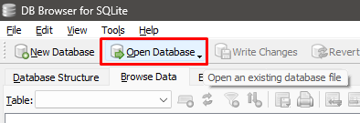
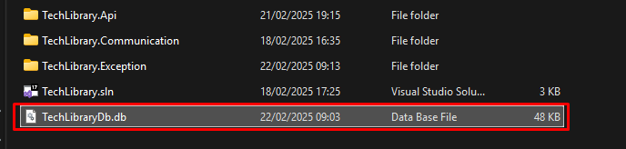

# Tech Library API


This project is an API built using **C#, .NET, Swagger, NuGet Packages, SQLite as the database, and JWT for authentication control.**

The API simulates the functionality of a **book reservation platform**, such as a library. Users have the possibility of registering on the platform and can search for books in the library. Logged-in users can checkout (reserve) the books they want.

https://github.com/user-attachments/assets/e0503bde-a81d-418a-a84a-620253b5f0f4

## Table of Contents

- [Installation](#installation)
- [NuGet Packages](#nuget-packages--versions)
- [Swagger](#swagger)
- [API Endpoints](#api-endpoints)
- [Authentication](#authentication)
- [Database](#database)
- [Contributing](#contributing)
- [License](#license)

## Installation

1. Install [Visual Studio IDE](https://visualstudio.microsoft.com/)

2. Install [DB Browser for SQLite](https://sqlitebrowser.org/dl/)

3. Install the **ASP.NET and web development** workload

4. Clone the repository:

```bash
git clone https://github.com/eduardxdc/api-techLibrary.git
```

## NuGet Packages & Versions
> .NET 9.0

* Microsoft.EntityFrameworkCore (8.0.12) <br>
* Microsoft.EntityFrameworkCore.Sqlite (8.0.12) <br>
* FluentValidation (11.11.0) <br>
* BCrypt.Net-Next (4.0.3) <br>
* Microsoft.IdentityModel.Tokens (8.3.1) <br>
* System.IdentityModel.Tokens.Jwt (8.3.1) <br>
* Microsoft.AspNetCore.Authentication.JwtBearer (8.0.12) <br>
* Swashbuckle.AspNetCore (6.4.0)

## Swagger
For those using **.NET 9** and needing to reconfigure Swagger in their project, you will need to modify two files: ``Program.cs`` and ``launchSettings.json.``

File path: ``TechLibrary.Api/Program.cs``:
```csharp
builder.Services.AddSwaggerGen();


// Changes inside the if statement:

if (app.Environment.IsDevelopment())
{
    app.UseSwagger();
    app.UseSwaggerUI();
}
```

File path: ``TechLibrary.Api/Properties/launchSettings.json``:
```csharp
"http": {
  "commandName": "Project",
  "dotnetRunMessages": true,
  "launchBrowser": true, // CHANGE THIS TO TRUE
  "launchUrl": "swagger", // ADD THIS LINE
  "applicationUrl": "http://localhost:5089",
  "environmentVariables": {
    "ASPNETCORE_ENVIRONMENT": "Development"
  }
},
"https": {
  "commandName": "Project",
  "dotnetRunMessages": true,
  "launchBrowser": true, // CHANGE THIS TO TRUE
  "launchUrl": "swagger", // ADD THIS LINE
  "applicationUrl": "https://localhost:7187;http://localhost:5089",
  "environmentVariables": {
    "ASPNETCORE_ENVIRONMENT": "Development"
  }
}
```

So that the authorisation button appears on Swagger and it is possible to test the Login.

File path: ``TechLibrary.Api/Program.cs``:
```csharp

const string AUTHENTICATION_TYPE = "Bearer";

// Some other configurations:

builder.Services.AddSwaggerGen(options =>
{
    options.AddSecurityDefinition(AUTHENTICATION_TYPE, new OpenApiSecurityScheme
    {
        Description = @"JWT Authorization header using the Bearer scheme.
                      Enter 'Bearer' [space] and then your token in the text input below;
                      Example: 'Bearer 12345abcdef'",
        Name = "Authorization",
        In = ParameterLocation.Header,
        Type = SecuritySchemeType.ApiKey,
        Scheme = AUTHENTICATION_TYPE
    });

    options.AddSecurityRequirement(new OpenApiSecurityRequirement
    {
        {
            new OpenApiSecurityScheme
            {
                Reference = new OpenApiReference
                {
                    Type = ReferenceType.SecurityScheme,
                    Id = AUTHENTICATION_TYPE
                },
                Scheme = "oauth2",
                Name = AUTHENTICATION_TYPE,
                In = ParameterLocation.Header
            },
            new List<string>()
        }
    });
});
``` 

## API Endpoints
> **F5** to run the application

The API provides the following endpoints:

```markdown
GET /Books/Filter - Returns the list of books in the library, by page number or book title;

POST /Checkouts/{bookId} - Checkout a book by ID (Authorization access required);

POST /Login - Login into the App;

POST /Users - Register a new user into the App;
```

## Authentication
The API uses **JWT** for authentication control. To access protected endpoints as a **required** authorization access, type 'Bearer' [space] and then your token in the text input below; Example: 'Bearer 12345abcdef'.

## Database
The project utilizes [SQLite](https://sqlitebrowser.org/dl/) as the database. To open the database, use SQLite Browser, go to **Open Database** and select the database file present in the cloned project.




## Contributing

Contributions are welcome! If you find any issues or have suggestions for improvements, please open an issue or submit a pull request to the repository.

When contributing to this project, please follow the existing code style, [commit conventions](https://www.conventionalcommits.org/en/v1.0.0/), and submit your changes in a separate branch.

```bash
git clone git@github.com:eduardxdc/api-techLibrary.git
```

```bash
git checkout -b feature/NAME
```

At the end, open a Pull Request explaining the problem solved or feature made, if exists, append screenshot of visual modifications and wait for the review!

[How to create a Pull Request](https://www.atlassian.com/git/tutorials/making-a-pull-request) |
[Commit pattern](https://gist.github.com/joshbuchea/6f47e86d2510bce28f8e7f42ae84c716)

## License

This project is under [MIT](LICENSE) license
